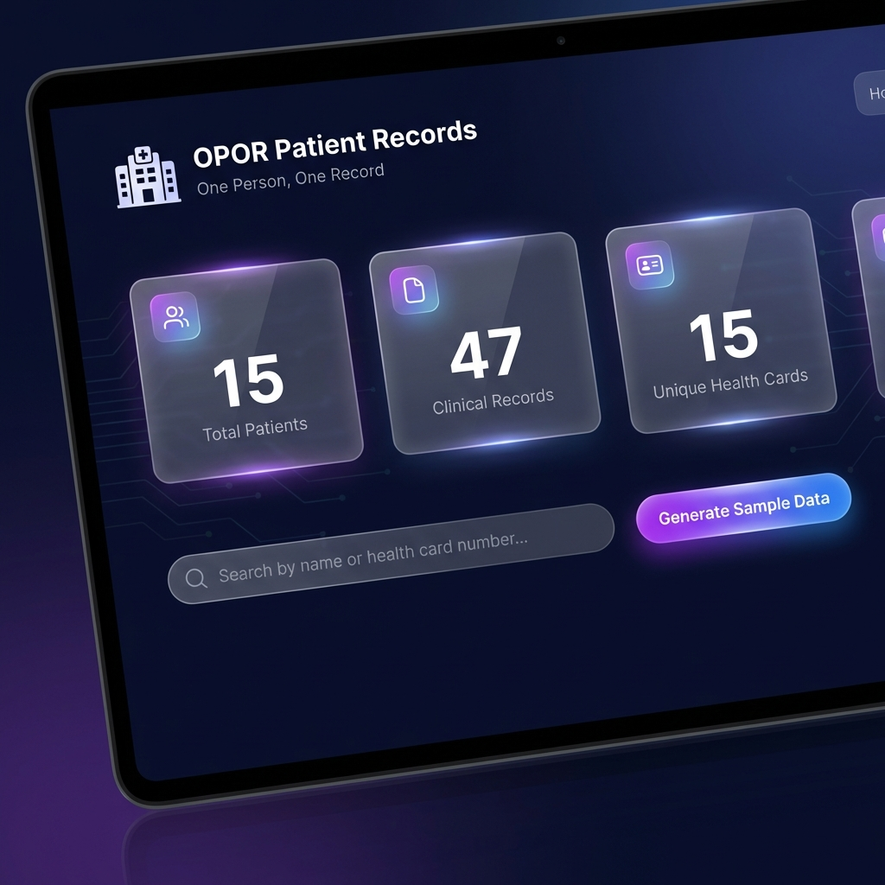
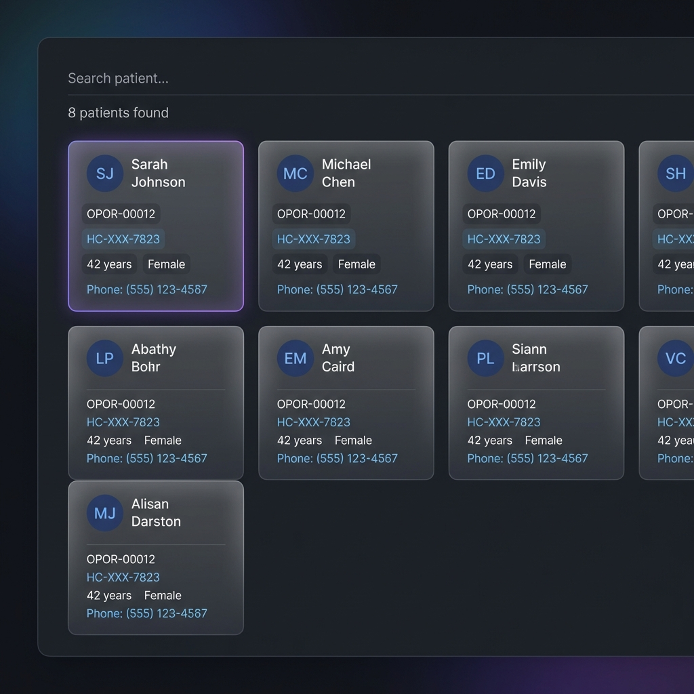
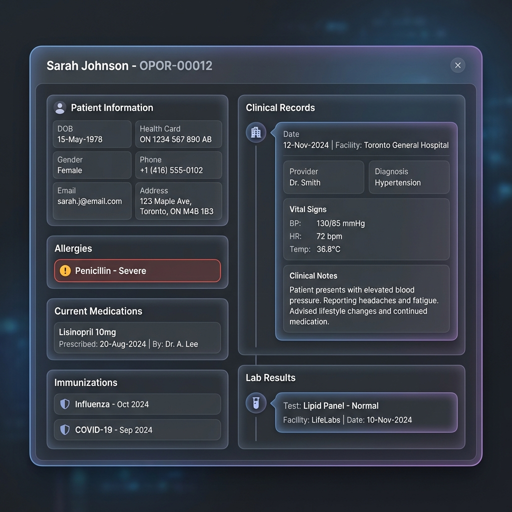
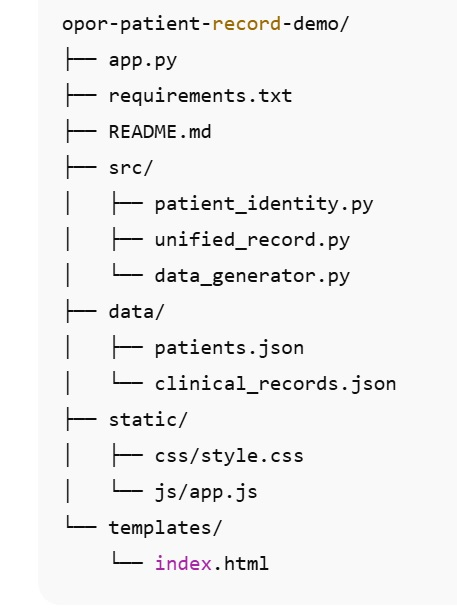

# OPOR Patient Record Demo 🇨🇦

> **One Person, One Record (OPOR)** – A demonstration project showcasing unified patient identity and clinical record management concepts aligned with Canadian healthcare digital health initiatives.


---

## 🎯 Project Overview

This project demonstrates the **One Person, One Record (OPOR)** concept, a foundational principle used in Canadian healthcare systems to ensure:

- **Unique Patient Identity** across all healthcare encounters  
- **Unified Clinical Records** per individual  
- **Improved Data Quality and Integrity**  
- **Reduced Duplication of Patient Records**  
- **Support for Interoperability and Continuity of Care**

The project is designed as a **portfolio and learning demonstration** for Clinical Systems Analysts, Clinical Informatics Analysts, and Healthcare IT professionals.

---

## 👨‍⚕️ Role Alignment – Clinical Systems / Informatics Analyst

This project reflects real-world responsibilities commonly found in **Canadian Clinical Systems Analyst / Clinical Informatics Analyst roles**, including:

- Supporting **OPOR-aligned workflows**
- Patient identity and record unification concepts
- Clinical data consistency and governance awareness
- Collaboration between clinical, administrative, and IT domains
- Preparing systems conceptually for interoperability and analytics

---

## ✨ Key Features

### 🆔 Patient Identity Management
- Unique patient identifier generation (`OPOR-XXXXX`)
- Health card number uniqueness enforcement
- Core demographic data management
- Patient search by name or identifier

### 🧾 Unified Clinical Record
- Consolidated patient records across encounters
- Medication history
- Allergy tracking with severity levels
- Immunization records
- Laboratory results
- Chronological clinical timeline

### 🔌 REST API Endpoints
- `GET /api/patients` – Retrieve all patients
- `GET /api/patients/search?q={query}` – Search patients
- `GET /api/patients/{patient_id}` – Retrieve patient profile
- `GET /api/records/{patient_id}` – Unified clinical record
- `POST /api/generate-data` – Generate sample data
- `GET /api/stats` – System statistics

---

## 🖥️ Professional Clinician-Friendly Web Interface

- Clean, modern dark UI
- Responsive layout (desktop & mobile)
- Patient cards with detailed views
- Real-time search
- Smooth transitions and animations
- Focus on readability and usability for clinical contexts

---

## � Screenshots

### 🖼️ Screenshot #1 — OPOR Dashboard (Main View) ⭐



**Most Important Screenshot** - Shows the complete OPOR system at a glance:
- System header with "OPOR Patient Records" branding
- Real-time statistics cards: Total Patients, Clinical Records, Unique Health Cards
- Patient search functionality
- Generate Sample Data button
- Premium glassmorphism design with vibrant gradients

**Why It Matters:** Immediately communicates this is a real OPOR system, not a simple educational demo.

---

### 🆔 Screenshot #2 — Patient Identity & Search ⭐



**OPOR Core Concept Demonstrated:**
- Unique OPOR ID for each patient (e.g., `OPOR-00012`)
- Masked health card numbers for privacy (`HC-XXX-7823`)
- Patient demographic cards with search results
- Clean, professional card-based interface

**Key OPOR Principles:**
- ✅ One Person = One Identity
- ✅ No Duplicate Records
- ✅ Search & Matching Logic
- ✅ Privacy-Aware Display

---

### 🏥 Screenshot #3 — Unified Clinical Record (Timeline View) ⭐



**The Golden Screenshot for Hiring Managers** - Shows complete longitudinal patient record:

**Clinical Data Sections:**
- **Patient Information**: Demographics, identifiers, contact details
- **Allergies**: With severity levels (Critical for patient safety)
- **Current Medications**: Active prescriptions with prescriber info
- **Immunizations**: Vaccination history with dates
- **Clinical Records**: Visit timeline with facilities, providers, diagnoses, vital signs
- **Lab Results**: Test results with dates and facilities

**OPOR Value Demonstrated:**
- ✅ Longitudinal patient record
- ✅ Continuity of care across facilities
- ✅ Complete clinical picture in one unified view
- ✅ Support for clinical decision-making and workflow

---

### 📁 Project Structure



**Organized File Hierarchy:**
- Clear separation of concerns (backend, frontend, data)
- Modular architecture with dedicated directories
- Professional project organization
- Easy to navigate and maintain

**Key Directories:**
- `src/` - Backend Python modules (patient identity, unified records, data generator)
- `static/` - Frontend assets (CSS, JavaScript)
- `templates/` - HTML templates
- `data/` - JSON data storage
- `screenshots/` - Project screenshots for documentation

---

## �🚀 Getting Started

### Prerequisites
- Python 3.8+
- pip

### Installation

```bash
git clone <repository-url>
cd opor-patient-record-demo
pip install -r requirements.txt
python app.py
```

Project Structure:
opor-patient-record-demo/
├── app.py
├── requirements.txt
├── README.md
├── src/
│   ├── patient_identity.py
│   ├── unified_record.py
│   └── data_generator.py
├── data/
│   ├── patients.json
│   └── clinical_records.json
├── static/
│   ├── css/style.css
│   └── js/app.js
└── templates/
    └── index.html


🏥 OPOR Principles Demonstrated

1️⃣ Unique Patient Identity

Each patient is represented by a single persistent identifier across all records.

2️⃣ Unified Record View

Clinical data is linked and displayed as a single longitudinal patient record.

3️⃣ Data Integrity

Uniqueness constraints and structured relationships reduce duplication.

4️⃣ Interoperability Awareness

REST APIs model integration readiness with other healthcare systems.

🔧 Technical Implementation
Backend

Flask-based REST API

Modular architecture

JSON-based storage (demo purpose)

Frontend

Vanilla JavaScript

Responsive HTML/CSS

Accessibility-aware UI design

Data Generation

Faker library

Realistic (but fictional) healthcare scenarios

Chronological clinical events

🇨🇦 Canadian Healthcare Context

This demonstration aligns conceptually with Canadian digital health initiatives such as:

One Person, One Record (OPOR)

Patient identity management

Clinical data standardization

Privacy-aware system design (PHIPA-aligned concepts)

🔐 Privacy & Confidentiality Disclaimer

⚠️ Important Notice
This project uses fully fictional data generated for demonstration purposes only.
No real patient data, identifiers, healthcare organizations, or facilities are used.
This project is not intended for production use.

📚 Skills Demonstrated

Clinical Systems Analysis

Clinical Informatics Concepts

OPOR & Patient Identity Management

Healthcare Data Modeling

REST API Design

Data Quality Awareness

Workflow Understanding

Documentation & Communication

📄 License

This project is open-source and licensed under the MIT License.

🤝 Contribution

This repository is intended as a demonstration project.
Suggestions and improvements are welcome.

Built to demonstrate OPOR concepts and Clinical Informatics thinking for the Canadian healthcare market 🇨🇦

---

## ✅ Final Notes & Portfolio Fit

🔹 This README is designed as a **Senior-level Portfolio presentation**  
🔹 Highly suitable for roles and organizations such as:
- Nova Scotia Health  
- Ontario Health  
- Clinical Informatics Lead  
- Clinical Systems Analyst  

If you’d like to extend this further:
- Create a **short/compact README version**
- Prepare a **Pinned GitHub Repository strategy**
- Write a **ready-to-post LinkedIn announcement** for this project  

Just let me know and we’ll continue 🚀

Note: All data in screenshots and demos is simulated for demonstration purposes. This system is designed for healthcare environments and includes features to ensure HIPAA compliance and data security.

Version: 2.0.0
Last Updated: January 2026
Author: Mohamed Mahmoud Youssef
